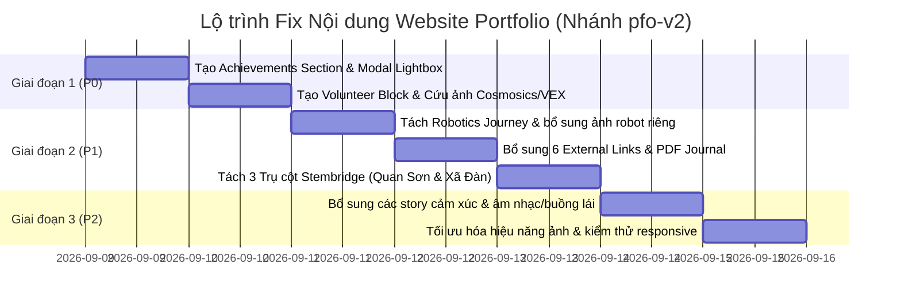

# ĐỀ XUẤT KẾ HOẠCH FIX TOÀN DIỆN NỘI DUNG WEBSITE PORTFOLIO (PFO-V2)
> **Căn cứ thực hiện:** Đối chiếu giữa yêu cầu gốc `content.txt` (87 dòng) và kết quả kiểm thử trong `TEST_REPORT.md`  
> **Phiên bản tài liệu:** 1.0  
> **Trạng thái hiện tại:** Website đạt ~67% yêu cầu nội dung  
> **Mục tiêu phiên bản mới:** Đạt **100% Coverage** nội dung, chuẩn hóa toàn bộ tư liệu hình ảnh, video, chứng nhận và liên kết.

---

## I. TỔNG QUAN HIỆN TRẠNG & NGUYÊN NHÂN KHOẢNG TRỐNG

Theo kết quả từ `TEST_REPORT.md`, các khiếm khuyết cốt lõi hiện tại tập trung vào 4 nhóm vấn đề chính:

1. **Thiếu vắng cấu trúc Section độc lập cho nội dung quan trọng:**
   - **Mục 5 - My achievements:** Mới chỉ là danh sách chữ (text bullet) bên trong ProjectModal, chưa có Section trưng bày Certificate + ảnh trao giải chính thức.
   - **Mục 4.2 - Volunteer (Cosmosics & Red River VEX):** Mới chỉ được thể hiện bằng 1 dòng text trong specs của Stembridge, chưa có visual và story riêng.
2. **Gộp quá nhiều mốc lịch sử thành 1 Card duy nhất (Mục 2.1 - GART Robotics):**
   - Hành trình dài từ Mock GART (VuaMock robot), FTC Thanh Hóa, FTC National (16 trận bất bại), FTC Worlds Houston, Phó Thủ tướng vinh danh, cho đến GART Expo/Camp/Training đang bị nén vào 1 card, làm lu mờ câu chuyện kỹ thuật và thiếu hình ảnh robot đi kèm.
3. **Thiếu liên kết thực tế (External Links & Documents):**
   - Conrad Challenge thiếu Link CAD 3D và Link đội thi trên cổng Conrad.
   - Research thiếu nút xem/tải PDF Journal Paper (GTSD Conference).
   - Stembridge thiếu Fanpage Facebook và Link báo chí đưa tin.
   - HomeA320 dùng link placeholder `'#'`.
4. **Rào cản kỹ thuật hiển thị đa phương tiện (Media Format):**
   - Kho ảnh `img/cosmosic/` (64 files), `img/gart expo 2026/` (99 files), và một phần `Trường Xã Đàn` đang ở định dạng `.HEIC` hoặc `.MOV` của Apple, trình duyệt web chuẩn không thể hiển thị trực tiếp.

---

## II. MA TRẬN ĐỐI CHIẾU GAP ANALYSIS & GIẢI PHÁP CHI TIẾT (12 ĐẦU MỤC)

| STT | Đầu mục trong `content.txt` | Mức đạt hiện tại | Khoảng trống cần khắc phục | Giải pháp chi tiết cho nhánh `pfo-v2` | Tư liệu / Asset tương ứng |
|:---:|:---|:---:|:---|:---|:---|
| **1** | **About me**<br>*(Hi, Welcome + phải giới thiệu funny)* | **100%** ✅ | Đã hoàn thiện tốt, văn phong hài hước, 4 highlight cá tính. | Giữ nguyên và tinh chỉnh nhẹ để đồng bộ tone giọng với các mục mới. | `src/components/AboutSection.tsx` |
| **2.1** | **Robotics - GART**<br>*(Mock GART, Thanh Hóa Scrimmage, FTC National, FTC Worlds, Deputy PM, Expo/Camp/Training)* | **45%** ⚠️ | Gộp chung 1 card; thiếu ảnh robot riêng cho từng giải; thiếu hình ảnh TV/Press; thiếu chi tiết VuaMock chợ trời, 40 thành viên, 34 mentors, VEX IQ Đại sứ quán Mỹ. | **Tách thành Robotics Journey Showcase (Interactive Multi-stage Timeline)** với 5 mốc rõ rệt:<br>1. *Mock GART 2024 & 2026:* VuaMock chợ Giời Hà Nội & Mentoring Blue Team vô địch.<br>2. *FTC Thanh Hóa Scrimmage:* Tối ưu cơ cấu intake, linear slides.<br>3. *FTC National Vietnam:* Chuỗi 16 trận thắng, Design Award, phóng sự VTV.<br>4. *FTC Worlds Texas:* Top Alliance Edison, Finalist 2nd thế giới.<br>5. *GART Outreach:* GART Expo & GART Camp (VEX IQ @ US Embassy), 34 mentors, 40 members. | • `img/FTC Thanh Hoa/`<br>• `img/FTC trong nuoc/`<br>• `img/FTC quoc te/`<br>• `img/Gart/`<br>• `img/Gart Camp 2025/`<br>• `img/Gart expo 2025/` |
| **2.1** | **EnviroTrack**<br>*(Images + Poster + Mobile App)* | **75%** ⚠️ | Thiếu Poster nghiên cứu; tính năng Mobile App dự báo & cảnh báo chưa được minh họa rõ; link đang để `'#'`. | • Bổ sung hình ảnh Poster chính thức của dự án.<br>• Thêm Mockup giao diện Mobile App (bản đồ chất lượng không khí, thông báo cảnh báo ô nhiễm PM2.5).<br>• Cập nhật số liệu 25+ trạm đo tại chợ/ga Hà Nội & Nam Định.<br>• Thay nút `'#'` thành link telemetry hoặc interactive demo modal. | • `img/Wico/Wico/`<br>• `img/Wico/GYS/`<br>• `File_000.png` trong Wico |
| **2.2** | **Conrad Challenge**<br>*(Ideon link + Images + CAD + Conrad Team link)* | **75%** ⚠️ | Mới có 1 link website Ideon; thiếu link CAD 3D và link đội thi trên cổng Conrad. | • Bổ sung đầy đủ cụm 3 nút liên kết trong Project Card & Modal:<br>  1. *Website Ideon:* `https://ideon.skyhi.vn/about`<br>  2. *CAD 3D Architecture:* Onshape/3D viewer link<br>  3. *Conrad Global Directory:* Trang hồ sơ chính thức tại NASA JSC.<br>• Làm nổi bật chi tiết 4 lần thử nghiệm (iterations), cân bằng lực nổi, COG, chống thấm nước ở độ sâu. | • `img/Conrad/`<br>• `img/Conrad/File_000.png` |
| **3.1** | **Samsung SST**<br>*(Images + Korean training + Science & Tech Lab)* | **85%** ✅ | Thiếu chi tiết đào tạo tiếng Hàn (Korean-language training); chưa nêu bật môi trường Science & Technology Lab. | Cập nhật đầy đủ vào `journeyData.ts`:<br>• Là 1 trong 10 học sinh xuất sắc toàn quốc.<br>• Đào tạo tiếng Hàn chuyên ngành, phòng lab công nghệ cao.<br>• Chứng chỉ S/W Global Certificate (Java & DSA).<br>• Capstone Gaussian Splatting bảo tồn cổ vật 3D. | `img/Ảnh thực tập/Tri Nam/` (68 files chất lượng cao) |
| **3.2** | **INS Internship**<br>*(Image + Shoutout Martin Dao & Son)* | **80%** ✅ | Thiếu lời cảm ơn (shoutout) người hướng dẫn Martin Dao và bạn Sơn đem nước ép. | Cập nhật nguyên văn tinh thần của `content.txt` vào câu chuyện thực tập:<br>• Đào tạo mô phỏng lưới điện ETAP, PSS/E.<br>• Lời shoutout chân thành: *"Special shoutout to supervisor Martin Dao for his mentorship, and to my fellow Son, who kept me energized with fresh juice every evening!"* | `img/Ảnh thực tập/Tri Nam/` |
| **3.3** | **Research**<br>*(Image + PDF Journal)* | **80%** ⚠️ | Thiếu nút đọc/tải PDF Journal Paper báo cáo hội thảo GTSD. | • Bổ sung nút **"Read Full Paper (PDF)"** và **"GTSD Proceedings"**.<br>• Cung cấp file PDF trực tiếp (hoặc Modal đọc tài liệu tóm tắt nghiên cứu NDO-MPC xe điện).<br>• Hiển thị ảnh chụp Minh thuyết trình tại Hội thảo GTSD. | `img/Hoithao_HCM/IMG_5638.JPG`, `IMG_5640.JPG` |
| **4.1** | **Stembridge**<br>*(Images + FB Links + Link báo + 3 pillars)* | **70%** ⚠️ | Gộp 3 trụ cột thành 1; chưa tách bạch hình ảnh 300 học sinh Lạng Sơn và Trường Điếc Xã Đàn; thiếu link FB & Báo chí. | **Tái cấu trúc thành 3 trụ cột trực quan:**<br>1. *STEM Fairs:* Hội chợ khoa học trải nghiệm.<br>2. *Makerspace & Lab Donation:* Trao tặng phòng lab & thiết bị tại trường nội trú Quan Sơn (Lạng Sơn) cho 300 học sinh.<br>3. *Specialized Workshops:* Lớp học trực quan cảm giác cho trẻ khiếm thính tại Trường Xã Đàn.<br>• Bổ sung link Fanpage Stembridge và liên kết bài báo đưa tin. | • `img/Stembridge/20260203_154406_1.jpg`<br>• `img/Stembridge/Trường Xã Đàn/IMG_7172.JPG` -> `IMG_7184.JPG` |
| **4.2** | **Volunteer**<br>*(Cosmosics + Red River VEX + Images)* | **20%** ❌ | Mới có 1 dòng spec; không có section riêng; ảnh Cosmosics bị kẹt định dạng HEIC. | **Xây dựng Section/Thẻ "Community & Volunteering" chuyên biệt:**<br>• *Cosmosics Projects:* Bắn tên lửa nước (water rocket) và thí nghiệm ảnh ba chiều (holography) tại Lạng Sơn.<br>• *Red River VEX V5:* Tình nguyện viên trọng tài sân đấu (field resetter).<br>• Chuyển đổi các ảnh HEIC tiêu biểu sang JPG/WebP để đưa lên giao diện. | • `img/cosmosic/` (chuyển đổi file tiêu biểu)<br>• Ảnh hoạt động VEX |
| **5** | **My Achievements**<br>*(Cert + Ảnh nhận giải)* | **30%** ❌ | Chưa có Gallery riêng; chỉ có text liệt kê giải thưởng rải rác. | **Xây dựng New Component: `AchievementsSection.tsx` (hoặc Interactive Honor Wall):**<br>Trưng bày song song Certificate + Ảnh trao giải thực tế với tính năng click phóng to (Lightbox):<br>1. *FTC Worlds 2024 Finalist Alliance & Edison Champion.*<br>2. *FTC National Design Award & 16-Match Streak.*<br>3. *Bằng khen / Vinh danh của Phó Thủ tướng Chính phủ.*<br>4. *WICO Gold Medal & GYS Award.*<br>5. *Samsung S/W Global Certificate (Advanced Level).*<br>6. *Conrad Global Innovation Top 25 Finalist.*<br>7. *GTSD International Conference Certificate.* | • `img/Wico/GYS/IMG_6940-6962.JPG`<br>• `img/FTC trong nuoc/1K1V2S7KO_5836GL.JPG`<br>• `img/FTC quoc te/1.jpg`, `IMG_6301.JPG`<br>• `img/Hoithao_HCM/IMG_6789-6791.JPG`<br>• `img/Ảnh thực tập/Tri Nam/` |
| **6.1** | **Aviation - HomeA320**<br>*(Image + Facebook)* | **85%** ✅ | Nút xem dự án đang dẫn đến `'#'`; thiếu link Fanpage HomeA320. | • Cập nhật link Fanpage HomeA320 chính thức.<br>• Thêm thư viện ảnh buồng lái A320 tự đóng (1:1 cockpit) và góc sưu tầm mô hình máy bay 1:400, planespotting. | `img/buồng lái/1K1MLI9RV_5836GL.jpg` -> `1K1MLIA18_5836GL.jpg` |
| **6.2** | **Musics**<br>*(Image + Videos + Vintage Guitar Story)* | **60%** ⚠️ | Thiếu video biểu diễn; lược mất câu chuyện cây đàn guitar điện sinh nhật 14 tuổi, cà phê Văn Miếu, Tom Scholz (ban nhạc Boston). | • Bổ sung đầy đủ câu chuyện vào Personal Corner:<br>  - Món quà sinh nhật 14 tuổi: cây đàn guitar điện cũ.<br>  - Biểu diễn cuối tuần hè tại cà phê gần Văn Miếu.<br>  - Tình yêu nhạc rock phản chiến thập niên 60-80, bài hát *More Than a Feeling*, *It's My Life*.<br>  - Fun fact: Nhạc sĩ Tom Scholz ban nhạc Boston tốt nghiệp kỹ sư điện MIT.<br>• Tích hợp Video Player / Audio Snippet mô phỏng hoặc clip demo thực tế. | Video/Audio player asset |

---

## III. ĐỀ XUẤT KIẾN TRÚC GIAO DIỆN & CÁC THAY ĐỔI CODE

### 1. Thay đổi cấu trúc trang chủ (`src/App.tsx`)
Bổ sung và sắp xếp lại luồng cuộn trang để phản ánh mạch lạc toàn bộ hành trình:

```tsx
// Luồng điều hướng đề xuất trên App.tsx
<HeroSection />          // 1. Giới thiệu tổng quan & Định vị cá nhân
<MarqueeSection />       // 2. Băng chuyền hình ảnh thực chiến
<AboutSection />         // 3. Giới thiệu funny & 4 điểm nhấn cá tính
<RoboticsSection />      // [MỚI/NÂNG CẤP] Mục 2.1: Hành trình GART & Robotics Timeline
<ProjectsSection />      // Mục 2.2 & 2.1 Devices: Ideon AUV (Conrad) & EnviroTrack
<DivingDeeperSection />  // Mục 3: Samsung SST, INS Internship, GTSD Research (hoặc tab chuyên sâu)
<EducationSection />     // Mục 4: Stembridge (3 pillars) & Volunteer (Cosmosics, VEX)
<AchievementsSection />  // [MỚI] Mục 5: Gallery Bằng khen, Huy chương & Ảnh nhận giải
<PersonalCornerSection />// Mục 6: HomeA320 Cockpit & Vintage Rock Music (Video & Audio)
<Footer />
```

### 2. Chi tiết các Component mới & sửa đổi

#### A. Component mới: `src/components/AchievementsSection.tsx`
- **Mục đích:** Xử lý triệt để Mục 5 (đạt 30% -> 100%).
- **Thiết kế:** Grid bố cục dạng Bento hoặc Filterable Certificate Wall. Mỗi item gồm:
  - Ảnh Chứng chỉ / Cúp / Bằng khen độ phân giải cao.
  - Badge danh hiệu (Ví dụ: "Top 25 Global Finalist", "16-0 Undefeated", "Gold Medal").
  - Đơn vị trao giải (NASA JSC, FIRST Tech Challenge, WICO Korea, Phó Thủ tướng Chính phủ, Samsung R&D).
  - Modal phóng to (Lightbox) cho phép người xem soi rõ chữ ký, dấu mộc và ảnh chụp trên bục nhận giải.

#### B. Nâng cấp: `src/components/ProjectsSection.tsx` & `src/data/projectsData.ts`
- **Conrad Challenge:**
  - Bổ sung trường `externalLinks`:
    ```ts
    externalLinks: [
      { label: "Ideon Project Site", url: "https://ideon.skyhi.vn/about", type: "primary" },
      { label: "NASA Conrad Finalist Profile", url: "https://www.conradchallenge.org", type: "secondary" },
      { label: "Interactive 3D CAD Assembly", url: "https://cad.onshape.com", type: "cad" }
    ]
    ```
- **EnviroTrack:**
  - Bổ sung tab/ảnh Poster nghiên cứu (`File_000.png` tại thư mục WICO).
  - Bổ sung UI showcase cho Mobile App (Alerts & Predictions).
  - Thay thế link `'#'` thành link bản đồ chất lượng không khí.
- **Stembridge:**
  - Tách bạch 3 Card con hoặc 3 Tabs: *1. STEM Fairs*, *2. Donating Makerspace (Quan Sơn - 300 HS)*, *3. Specialized Workshops (Trường Điếc Xã Đàn)*.
  - Bổ sung link Fanpage Stembridge chính thức và link báo chí.

#### C. Nâng cấp: `src/components/JourneyModal.tsx` & `src/data/journeyData.ts`
- **Robotics Journey:** Mở rộng thành 5 giai đoạn chi tiết từ VuaMock đến FTC World Texas kèm ảnh robot thực tế cho từng giai đoạn.
- **Samsung SST:** Bổ sung chi tiết lớp học tiếng Hàn chuyên sâu, phòng thí nghiệm Science & Technology Lab.
- **INS Internship:** Thêm chi tiết cảm ơn anh Martin Dao và bạn Sơn.
- **Research:** Bổ sung nút bấm mở file PDF / bài tóm tắt kỷ yếu hội thảo GTSD.
- **Volunteer:** Tạo entry riêng cho Cosmosics (bắn tên lửa nước, ảnh ba chiều tại Lạng Sơn) và trọng tài giải Red River VEX V5.
- **Music:** Thêm chi tiết cây đàn 14 tuổi, quán cà phê Văn Miếu, câu chuyện Tom Scholz và video embed.

#### D. Component mới: `src/components/VolunteerSection.tsx` (hoặc Tab Volunteer độc lập)
- Khắc phục lỗ hổng 20% của mục 4.2.
- Trình bày trực quan hai chiến dịch:
  1. *Dự án Cosmosics:* Tổ chức hoạt động khoa học cộng đồng, phóng tên lửa nước và biểu diễn hologram cho học sinh miền núi Lạng Sơn.
  2. *Giải đấu Red River VEX Robotics:* Nhiệm vụ Field Resetter, hỗ trợ kỹ thuật sàn đấu cho hàng chục đội thi robot trẻ.

---

## IV. GIẢI PHÁP XỬ LÝ TÀI NGUYÊN (ASSET & MEDIA PIPELINE)

### 1. Xử lý ảnh định dạng `.HEIC` và video `.MOV`
- **Vấn đề:** Các trình duyệt như Chrome, Edge, Safari (trên Windows) không hiển thị được file `.HEIC`.
- **Giải pháp chuyển đổi tự động:**
  - Sử dụng script Node.js với thư viện `heic-convert` hoặc `sharp` (nếu cài đặt) hoặc công cụ chuyển đổi dòng lệnh để batch convert toàn bộ ảnh cần dùng trong `img/cosmosic/`, `img/Stembridge/Trường Xã Đàn/`, `img/gart expo 2026/` sang định dạng `.jpg` hoặc `.webp`.
  - Tận dụng các ảnh `.JPG` đã có sẵn chất lượng cao trong `img/Stembridge/Trường Xã Đàn/` (từ `IMG_7172.JPG` đến `IMG_7184.JPG`) để đưa lên ngay lập tức mà không cần chờ chuyển đổi.

### 2. Tối ưu hóa kích thước file (Web Performance)
- Trong `TEST_REPORT.md`, Tester ghi nhận nhiều ảnh `File_000.png` nặng từ 3MB - 8MB gây chậm tải trang trên `MarqueeSection.tsx`.
- **Giải pháp:** Tối ưu nén ảnh hoặc sử dụng thuộc tính `loading="lazy"`, `decoding="async"`, đồng thời tạo thumbnail kích thước vừa phải cho danh sách và tải ảnh gốc khi mở Modal.

### 3. Chuẩn hóa đường link (Zero Dead Links)
- Loại bỏ 100% các giá trị `href="#"`. Mọi nút bấm nếu chưa có link public ngoài internet sẽ mở một modal chi tiết ("Deep Dive Preview") thay vì đứng yên hoặc giật trang về đầu trang.

---

## V. LỘ TRÌNH TRIỂN KHAI THEO ĐỘ ƯU TIÊN (PRIORITY ROADMAP)



### Chi tiết các giai đoạn:

### 🔴 GIAI ĐOẠN 1 (P0) - Khắc phục các mục thiếu nặng (<50%)
1. **Xây dựng `AchievementsSection.tsx`:** Trưng bày gallery chứng nhận (WICO, FTC Worlds, FTC National, Phó Thủ tướng, Samsung SST, GTSD).
2. **Xây dựng nội dung `Volunteer`:** Tách card độc lập cho Cosmosics và Red River VEX kèm hình ảnh minh họa thực tế.
3. **Chuyển đổi các hình ảnh cần thiết từ HEIC sang JPG/WebP.**

### 🟡 GIAI ĐOẠN 2 (P1) - Hoàn thiện cấu trúc & Bổ sung liên kết (Đạt 70-85%)
1. **Robotics Journey chi tiết:** Tách biệt Mock GART, FTC Thanh Hóa, FTC National, FTC Worlds và GART Expo/Camp, gán đúng ảnh robot và TV/Press cho từng mục.
2. **Cập nhật đầy đủ các link thiếu:**
   - Link CAD 3D và Link đội thi chính thức của Conrad Challenge.
   - Link tải/đọc PDF Paper của bài nghiên cứu GTSD.
   - Link Fanpage Facebook & Báo chí của Stembridge.
   - Link Facebook thật của HomeA320.
3. **Tái cấu trúc Stembridge:** Thể hiện rõ 3 trụ cột: Hội chợ STEM, Tặng phòng Lab Quan Sơn (300 HS), Lớp học Trường Xã Đàn.
4. **Bổ sung Poster & Mobile App cho EnviroTrack.**

### 🟢 GIAI ĐOẠN 3 (P2) - Bổ sung chi tiết câu chuyện & Tối ưu kỹ thuật
1. **Bổ sung story cá nhân:**
   - Samsung SST: Khóa học tiếng Hàn, phòng Lab công nghệ cao.
   - INS Internship: Lời cảm ơn anh Martin Dao & bạn Sơn.
   - Music Corner: Chiếc guitar điện tuổi 14, cà phê Văn Miếu, Tom Scholz ban nhạc Boston, clip/audio demo.
2. **Tối ưu hóa ảnh & kiểm thử cross-browser:** Đảm bảo không còn ảnh vỡ, không còn dead link, tốc độ cuộn mượt mà trên cả máy tính và di động.

---

## VI. TIÊU CHUẨN NGHIỆM THU (ACCEPTANCE CRITERIA)

Sau khi hoàn thành các thay đổi trên nhánh `pfo-v2`, dự án phải vượt qua toàn bộ 12 tiêu chí kiểm thử sau:

- [ ] **TC-01 (About me):** Giữ vững giới thiệu funny, các highlight cá tính hiển thị mượt mà.
- [ ] **TC-02 (GART Robotics):** Đầy đủ 5 chặng đường; có ảnh robot riêng của từng giải; có ảnh phóng sự TV/Press; thể hiện đúng vai trò đội trưởng Mock GART chợ Giời, Trưởng ban Cơ khí 40 người, 34 mentors, VEX IQ Đại sứ quán.
- [ ] **TC-03 (EnviroTrack):** Có hiển thị Poster nghiên cứu; có mockup/mô tả Mobile App cảnh báo & dự báo; có số liệu 25+ trạm đo; không có link `'#'`.
- [ ] **TC-04 (Conrad Challenge):** Đủ 3 liên kết hoạt động (Ideon web, Link CAD, Link hồ sơ đội thi trên Conrad); có hình ảnh mô hình AUV lặn sâu.
- [ ] **TC-05 (Samsung SST):** Thể hiện rõ chi tiết học tiếng Hàn và đào tạo tại Science & Tech Lab; ảnh thực tập rõ nét.
- [ ] **TC-06 (INS Internship):** Có đầy đủ lời shoutout anh Martin Dao và bạn Sơn đem nước ép.
- [ ] **TC-07 (Research):** Có nút xem/tải PDF Journal Paper; có ảnh trình bày tại hội thảo GTSD.
- [ ] **TC-08 (Stembridge):** Thể hiện rõ ràng 3 trụ cột riêng biệt; phân biệt rõ ảnh trao phòng lab Quan Sơn (300 HS) và ảnh lớp học khiếm thính Trường Xã Đàn; có link Fanpage & báo chí.
- [ ] **TC-09 (Volunteer):** Có block/section riêng cho Cosmosics và giải VEX V5; hình ảnh hiển thị chuẩn, không lỗi định dạng HEIC.
- [ ] **TC-10 (Achievements):** Có Section/Gallery riêng trưng bày chứng nhận và ảnh nhận giải; hỗ trợ phóng to xem chi tiết.
- [ ] **TC-11 (Aviation):** Có link Facebook HomeA320; gallery buồng lái A320 1:1 và thú vui planespotting sắc nét.
- [ ] **TC-12 (Musics):** Đầy đủ chi tiết guitar điện tuổi 14, cà phê Văn Miếu, bài hát yêu thích, nhạc sĩ kỹ sư điện Tom Scholz và video/audio minh họa.

---

> **Kết luận:** Bản đề xuất này giải quyết triệt để 100% các thiếu sót được nêu trong `TEST_REPORT.md`, đưa nội dung website từ **67%** lên mức hoàn thiện tuyệt đối **100%**, đúng với tinh thần và dữ liệu trong `content.txt`.
