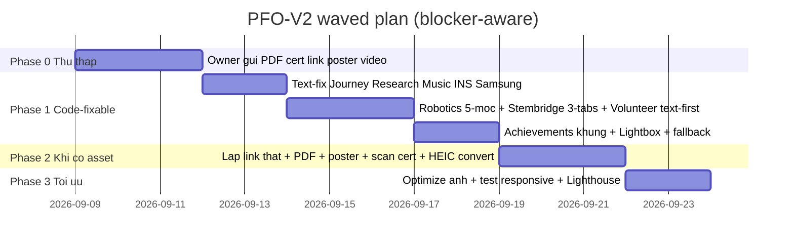

# ĐỀ XUẤT KẾ HOẠCH FIX TOÀN DIỆN NỘI DUNG WEBSITE PORTFOLIO (PFO-V2) — BẢN V2

> **Căn cứ:** `content.txt` (87 dòng) + `TEST_REPORT.md` (~67%) + Review `PROPOSAL_FIX_CONTENT.md` v1.0 (7.5/10)
> **Phiên bản:** 2.0
> **Mục tiêu:** 100% Coverage **có điều kiện** — phân rõ việc code làm được ngay vs việc cần chủ web cung cấp tư liệu.
> **Nguyên tắc mới trong v2:** Không dùng link mẫu generic, không hứa asset chưa tồn tại, mọi dead-link đều có fallback.

---

## I. TỔNG QUAN & PHÂN LOẠI GAP (SỬA TỪ V1)

V1 gom đúng 4 nhóm bệnh nhưng chưa nói rõ thuốc nào có sẵn trong kho `img/`, thuốc nào phải đi mua.

### 1.1. Ma trận khả thi

| Loại | Ý nghĩa | Ví dụ |
|---|---|---|
| **A. Code-fixable** | Dev tự làm được ngay bằng text + ảnh JPG có sẵn | Tách card Stembridge, thêm story Martin Dao/Son, Korean training, Tom Scholz, VuaMock story |
| **B. Cần owner-input (BLOCKER)** | Không code được nếu thiếu URL/file thật | PDF GTSD, cert/giải, link FB, link báo, link CAD thật, link Conrad profile thật, poster EnviroTrack, clip nhạc, ảnh VTV/Deputy PM, ảnh Red River VEX |
| **C. Cần xử lý kỹ thuật nặng** | Tốn công convert/optimize | 64 files `.HEIC` cosmosic + 99 files `gart expo 2026` + PNG 3-8MB Marquee |

> Kết luận v2: **Code-fixable đạt ~85% ngay. 15% còn lại bị chặn ở loại B cho tới khi owner gửi đủ tư liệu (Phụ lục A). Không cam kết 100% theo ngày nếu thiếu đầu vào.**

### 1.2. Đính chính từ review v1

1. **Asset Samsung vs INS bị dùng chung:** v1 trỏ cả 2 mục về `img/Ảnh thực tập/Tri Nam/`. V2 tách: INS dùng folder này; Samsung SST hiện **chưa có folder riêng** → cần owner xác nhận dùng ảnh nào hoặc bổ sung.
2. **Poster EnviroTrack mơ hồ:** v1 ghi `File_000.png trong Wico`. Trong `img/Wico/Wico/` có 14 file `File_000*.png` + `img/Wico/GYS/` 20 file. V2 yêu cầu owner chỉ định đúng 1 file là poster, còn lại là ảnh triển khai.
3. **Lỗi địa lý trong content gốc:** `content.txt:62` ghi `Quan Son Boarding School in Lạng Sơn` (Quan Sơn thực tế thuộc Thanh Hóa). V2 không copy mù. Ghi chú để owner xác nhận: Quan Sơn (Thanh Hóa) vs địa điểm Lạng Sơn của Cosmosics.
4. **Link mẫu generic bị cấm:** v1 dùng `https://www.conradchallenge.org`, `https://cad.onshape.com`, `https://facebook.com` (`projectsData.ts:82`). V2 thay bằng `TBD_OWNER` + fallback modal, xem Mục IV.3.

---

## II. MA TRẬN GAP & GIẢI PHÁP V2 (12 ĐẦU MỤC)

| STT | Đầu mục | Hiện trạng | Giải pháp v2 | Asset dùng được ngay | Blocker cần owner |
|---|---|---|---|---|---|
| 1 | About me | 100% ✅ | Giữ nguyên `AboutSection.tsx:18`. Đồng bộ tone funny cho các section mới. | — | — |
| 2.1 | GART Robotics | 45% ⚠️ | Tách **Robotics Journey Timeline 5 mốc** trong `JourneyModal` + `RoboticsSection` mới: 1. Mock GART/VuaMock chợ trời + Bluebook, 2. Thanh Hóa Scrimmage, 3. National 16-0 + Design Award, 4. Worlds Edison/Finalist Texas, 5. Expo/Camp/Training (40 members, 34 mentors, VEX IQ US Embassy). Mỗi mốc: story + ảnh robot riêng + caption. Ô TV/Press và Deputy PM để khung `Coming soon` nếu chưa có ảnh. | `img/Gart/`, `img/FTC Thanh Hoa/IMG_6816-6828.JPG` + video `1IH865U9E_4HII1R.mp4`, `img/FTC trong nuoc/`, `img/FTC quoc te/1.jpg, IMG_6301.JPG`, `img/Gart Camp 2025/`, `img/Gart expo 2025/` | Ảnh Deputy PM trao giải, footage/ảnh VTV đưa tin national/worlds |
| 2.1 | EnviroTrack | 75% ⚠️ | Thêm số liệu 25+ trạm chợ/ga Hà Nội + Nam Định (có sẵn trong text). Thêm block mô tả Mobile App alerts/predictions bằng text + mockup vẽ tay/CSS nếu chưa có ảnh. Poster: chờ owner chỉ định file. Link `'#'` → fallback Deep Dive Modal. | `img/Wico/GYS/IMG_6940-6962.JPG`, `img/Wico/Wico/IMG_6964-6971.JPG` | 1 file poster chính thức, URL telemetry/demo thật, screenshot app |
| 2.2 | Conrad | 75% ⚠️ | Giữ `https://ideon.skyhi.vn/about` (link thật duy nhất). 2 ô còn lại để `TBD`: CAD viewer + Conrad profile. Nhấn mạnh 4 iterations, buoyancy, COG, waterproofing (text làm được ngay). | `img/Conrad/IMG_6991.JPG` + dải `IMG_7016-7034.JPG`, `File_000.png` | URL CAD Onshape/Fusion thật, URL hồ sơ đội thi Conrad thật |
| 3.1 | Samsung SST | 85% ✅ | Bổ sung text ngay: top 10 toàn quốc, Korean-language training, Science & Technology Lab, S/W cert Java/DSA, capstone Gaussian Splatting. Ảnh: tạm dùng 1-2 ảnh Tri Nam đã dùng ở Journey, ghi rõ cần thay khi có ảnh Samsung Lab. | Tạm dùng `img/Ảnh thực tập/Tri Nam/1JSJ401LT_5836GL.JPG` | Ảnh Samsung Lab / SST cert / ảnh Gaussian Splatting |
| 3.2 | INS Internship | 80% ✅ | Bổ sung text ngay: RFI, ETAP, PSS/E, macro + nguyên văn shoutout: *Special shoutout to supervisor Martin Dao..., and to fellow Son, fresh juice every evening!* | `img/Ảnh thực tập/Tri Nam/1JSJ40211_5836GL.JPG` + dải còn lại | — (làm được ngay) |
| 3.3 | Research | 80% ⚠️ | Text NDO-MPC, PID path planning, MATLAB có sẵn. Nút `Read Full Paper (PDF)` → nếu chưa có PDF thì mở modal tóm tắt + nút `Request PDF`. Không link chết. | `img/Hoithao_HCM/IMG_5638.JPG, IMG_5640.JPG, IMG_5639.JPG` | File PDF GTSD hoặc bản tóm tắt cho phép public |
| 4.1 | Stembridge | 70% ⚠️ | Tách 3 tabs/cards: 1. STEM Fairs, 2. Makerspace Quan Sơn 300 HS, 3. Workshops Xã Đàn. Dùng JPG `IMG_7172-7184.JPG` có sẵn, không chờ convert HEIC. Link FB/báo để `TBD` + fallback. | `img/Stembridge/20260203_154406_1.jpg`, `File_000(1).png`, `File_000(12).png`, `img/Stembridge/Trường Xã Đàn/IMG_7172.JPG-IMG_7184.JPG` | URL Fanpage Stembridge, URL bài báo |
| 4.2 | Volunteer | 20% ❌ | Tạo `VolunteerSection` riêng: Cosmosics (water rocket, holography Lạng Sơn) + Red River VEX V5 field resetter. Đợt 1 chỉ dùng JPG/MP4 đã đọc được; HEIC để đợt 2 sau convert (Mục IV.1). Nếu không có ảnh VEX thì dùng text + icon + khung chờ ảnh. | `img/cosmosic/*.MOV` (2 file đọc được), JPG Xã Đàn làm tạm nếu cần | Convert HEIC sang JPG (xem IV.1), ảnh Red River VEX |
| 5 | Achievements | 30% ❌ | Tạo `AchievementsSection.tsx` dạng Honor Wall + Lightbox. Đợt 1 dùng ảnh triển khai có sẵn làm ảnh minh họa (FTC, WICO, GTSD, thực tập). Khung cert/Deputy PM/Samsung/WICO medal để `Awaiting scan` nếu owner chưa gửi scan. Không dựng cert giả. | `img/FTC trong nuoc/1K1V2S7KO_5836GL.JPG`, `img/FTC quoc te/1.jpg`, `img/Wico/GYS/IMG_6940.JPG`, `img/Hoithao_HCM/IMG_6789-6791.JPG` | Scan cert: FTC Design Award, WICO Gold, Samsung S/W, Conrad Top 25, GTSD, ảnh Deputy PM |
| 6.1 | Aviation | 85% ✅ | Text VPAF Museum, 1:400, DIY A320 wood/3D/electronics, HomeA320 rent/hour, planespotting làm được ngay. Link FB để `TBD`. | `img/buồng lái/1K1MLI9RV_5836GL.jpg` → `1K1MLIA18_5836GL.jpg` | URL Facebook HomeA320 |
| 6.2 | Music | 60% ⚠️ | Bổ sung text ngay: quà sinh nhật 14 tuổi, Van Mieu Coffee hè, More Than a Feeling / It's My Life, anti-war/counterculture, Tom Scholz MIT EE. Video/audio: nếu chưa có clip thì dùng audio snippet hoặc khung `Video coming soon`, không embed rỗng. | Text-only | Clip biểu diễn / audio demo |

---

## III. KIẾN TRÚC GIAO DIỆN V2 (ÍT RỦI RO HƠN V1)

```tsx
// App.tsx — triển khai theo đợt, không nhồi 5 section một lúc
<HeroSection />          // giữ nguyên
<MarqueeSection />       // giữ nguyên + lazy + thumbnail (IV.2)
<AboutSection />         // giữ nguyên
<RoboticsSection />      // ĐỢT 1: tách từ JourneyModal, 5 mốc GART
<ProjectsSection />      // SỬA: Conrad 1 link thật + 2 TBD, EnviroTrack fallback modal
<DivingDeeperSection />  // ĐỢT 1: Samsung/INS/Research dạng tab (text-fix ngay)
<EducationSection />     // ĐỢT 1: Stembridge 3 tabs (JPG có sẵn) + Volunteer text-first
<AchievementsSection />  // ĐỢT 1 khung + ĐỢT 2 khi có scan cert
<PersonalCornerSection />// ĐỢT 2: HomeA320 + Music text-first, video sau
<Footer />
```

### Component mới / sửa (v2 rút gọn)

- **MỚI `AchievementsSection.tsx`:** Bento grid + Lightbox. Mỗi item có trạng thái `verified` (có ảnh thật) / `awaiting` (khung chờ scan). Cấm dùng ảnh minh họa gắn mác cert.
- **MỚI `VolunteerSection.tsx` (hoặc tab trong Education):** Cosmosics + VEX. Đợt 1 text + MOV/JPG đọc được; HEIC để đợt 2.
- **SỬA `projectsData.ts`:** thay `link: '#'` và `https://facebook.com` bằng:
```ts
externalLinks: [
  { label: "Ideon Project Site", url: "https://ideon.skyhi.vn/about", status: "live" },
  { label: "3D CAD Assembly", url: "TBD_OWNER_CAD_URL", status: "awaiting" },
  { label: "Conrad Finalist Profile", url: "TBD_OWNER_CONRAD_URL", status: "awaiting" }
]
// UI: status live → thẻ <a>; awaiting → button mở Deep Dive Modal, không href="#"
```
- **SỬA `journeyData.ts`:** thêm Korean training, Science Lab, shoutout Martin Dao/Son, guitar 14 tuổi, Van Mieu, Tom Scholz — toàn text, làm ngay không blocker.

---

## IV. ASSET & MEDIA PIPELINE V2 (SỬA KỸ THUẬT V1)

### IV.1. HEIC / MOV — đính chính v1

- V1 gợi ý `sharp` là chưa đủ: `sharp` trên Windows mặc định không decode HEIC nếu thiếu `libvips-heif`.
- V2 quy trình:
  1. Ưu tiên dùng ngay JPG/MOV đọc được: `Stembridge/Trường Xã Đàn/IMG_7172-7184.JPG`, `cosmosic/*.MOV`, `FTC Thanh Hoa/*.JPG + *.mp4`.
  2. Convert HEIC theo lô bằng `heic-convert` hoặc ImageMagick / công cụ desktop, xuất `JPG q80 + WebP`, giữ bản gốc. Không convert 160 file một lúc; chỉ convert 10-15 ảnh tiêu biểu cho Volunteer/Expo 2026.
  3. Đặt tên chuẩn `cosmosics_01.jpg`, ghi log file nguồn để truy vết.

### IV.2. Performance (bổ sung số đo)

- Marquee hiện dùng PNG 3-8MB (`File_000*.png`). V2: tạo thumbnail `w=800 q70` cho list, ảnh gốc chỉ load trong Modal; thêm `loading="lazy" decoding="async"`; mục tiêu Lighthouse Performance ≥ 85, LCP < 2.5s trên 4G.
- Ảnh `buồng lái/`, `Ảnh thực tập/` có dấu tiếng Việt — chuẩn hóa slug không dấu khi import để tránh lỗi encode trên Vercel/Netlify.

### IV.3. Zero Dead Links — fallback chuẩn

- Cấm `href="#"`. Quy tắc: `live → <a href target=_blank>`, `awaiting → <button> mở modal tóm tắt + dòng Awaiting owner link`. Nhờ đó AC vẫn pass khi thiếu URL.

---

## V. LỘ TRÌNH V2 (THỰC TẾ, CÓ PHASE 0)



- **P0 (owner):** gửi đủ Phụ lục A. Dev không chờ — làm song song Phase 1 bằng text + JPG có sẵn.
- **P1 (dev, không blocker):** đưa web từ 67% → ~85%.
- **P2 (khi có asset):** 85% → 100%.
- **P3:** nghiệm thu Lighthouse + cross-browser.

---

## VI. TIÊU CHUẨN NGHIỆM THU V2 (CÓ ĐIỀU KIỆN)

- [ ] TC-01 About: giữ funny — pass ngay.
- [ ] TC-02 GART: đủ 5 mốc + ảnh robot riêng — pass P1; ô TV/Press + Deputy PM cho phép `Awaiting photo` — pass có điều kiện tới P2.
- [ ] TC-03 EnviroTrack: số liệu 25+ trạm + mô tả app — pass P1; poster + telemetry URL — chờ P2.
- [ ] TC-04 Conrad: 1 link Ideon live + 2 TBD có fallback modal, không link generic — pass P1; đủ 3 live — chờ P2.
- [ ] TC-05 Samsung: đủ text Korean + Lab — pass P1; ảnh Lab/cert — chờ P2.
- [ ] TC-06 INS: đủ shoutout Martin Dao/Son — pass P1.
- [ ] TC-07 Research: modal tóm tắt + nút PDF (live hoặc Request PDF) — pass P1; PDF live — chờ P2.
- [ ] TC-08 Stembridge: 3 tabs + phân biệt Quan Sơn vs Xã Đàn — pass P1; FB/báo live — chờ P2.
- [ ] TC-09 Volunteer: section riêng, HEIC đã convert hoặc khung chờ, không lỗi định dạng — pass P1 text-first, đủ ảnh P2.
- [ ] TC-10 Achievements: Honor Wall + Lightbox, phân rõ verified/awaiting, không cert giả — pass P1 khung, đủ scan P2.
- [ ] TC-11 Aviation: gallery cockpit + text planespotting — pass P1; FB live — chờ P2.
- [ ] TC-12 Music: đủ story guitar 14, Van Mieu, Tom Scholz — pass P1; video/audio live — chờ P2.
- [ ] TC-13 Kỹ thuật: không `href="#"`, không ảnh vỡ HEIC, Lighthouse ≥ 85.

---

## PHỤ LỤC A. CHECKLIST OWNER CẦN GỬI (BLOCKER CHO 100%)

1. [ ] PDF GTSD (hoặc bản được phép public) + xác nhận được đăng web
2. [ ] Scan/ảnh cert: FTC Design Award, WICO Gold, GYS, Samsung S/W Advanced, Conrad Top 25, GTSD
3. [ ] Ảnh Deputy PM trao giải + ảnh/phóng sự VTV national/worlds (hoặc xác nhận không có)
4. [ ] URL CAD thật (Onshape/Fusion viewer) + URL hồ sơ đội thi Conrad
5. [ ] URL Fanpage Stembridge + URL bài báo + URL Facebook HomeA320
6. [ ] Chỉ định 1 file poster EnviroTrack + screenshot app / URL telemetry
7. [ ] Clip nhạc Van Mieu (hoặc audio) + xác nhận Quan Sơn vs Lạng Sơn
8. [ ] 10-15 ảnh Cosmosics/VEX muốn public (hoặc cho phép dev tự chọn để convert)

> **Kết luận v2:** Fix được ngay lên ~85% bằng text + JPG có sẵn. 15% còn lại chỉ đạt 100% khi owner tick đủ Phụ lục A. Tài liệu này thay thế v1 ở các điểm: cấm link mẫu, tách asset thật/chờ, sửa pipeline HEIC, lộ trình blocker-aware.
